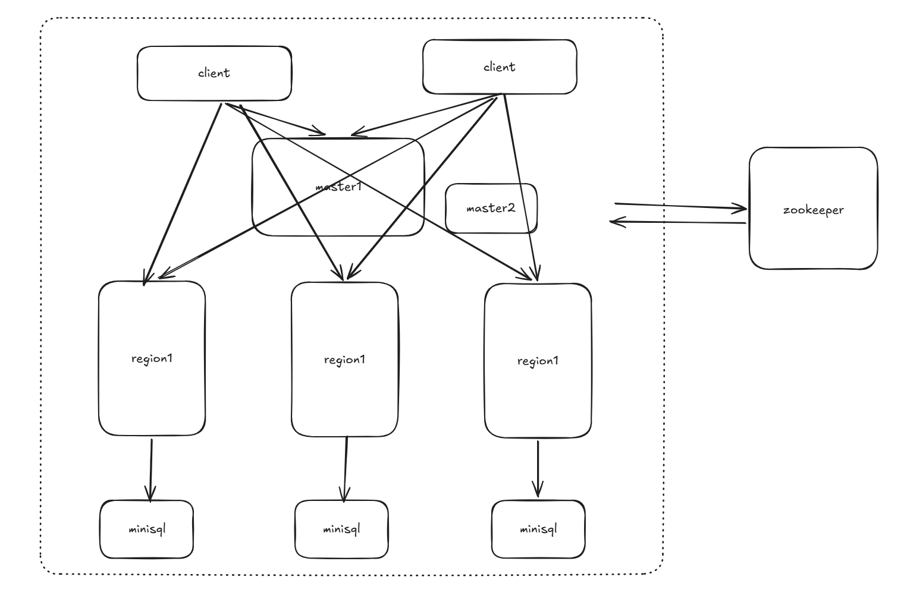
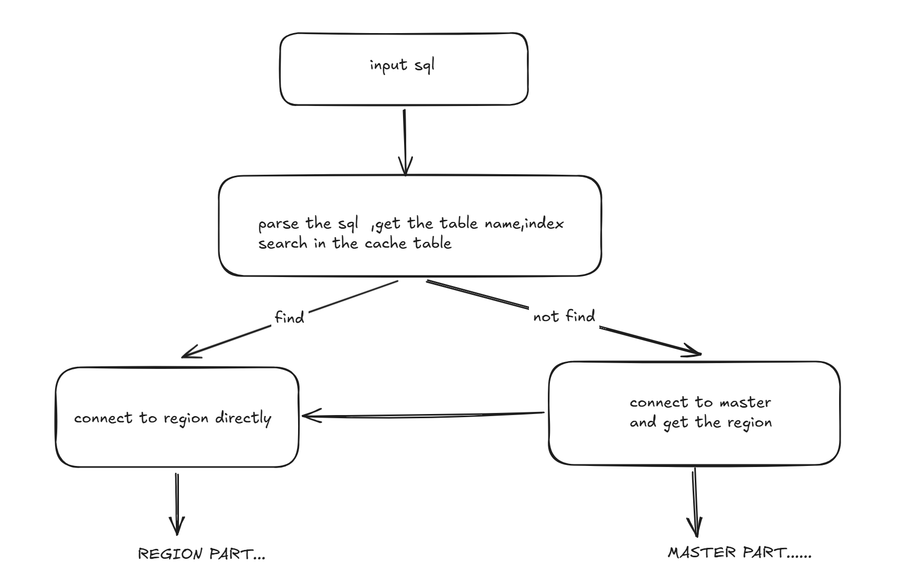
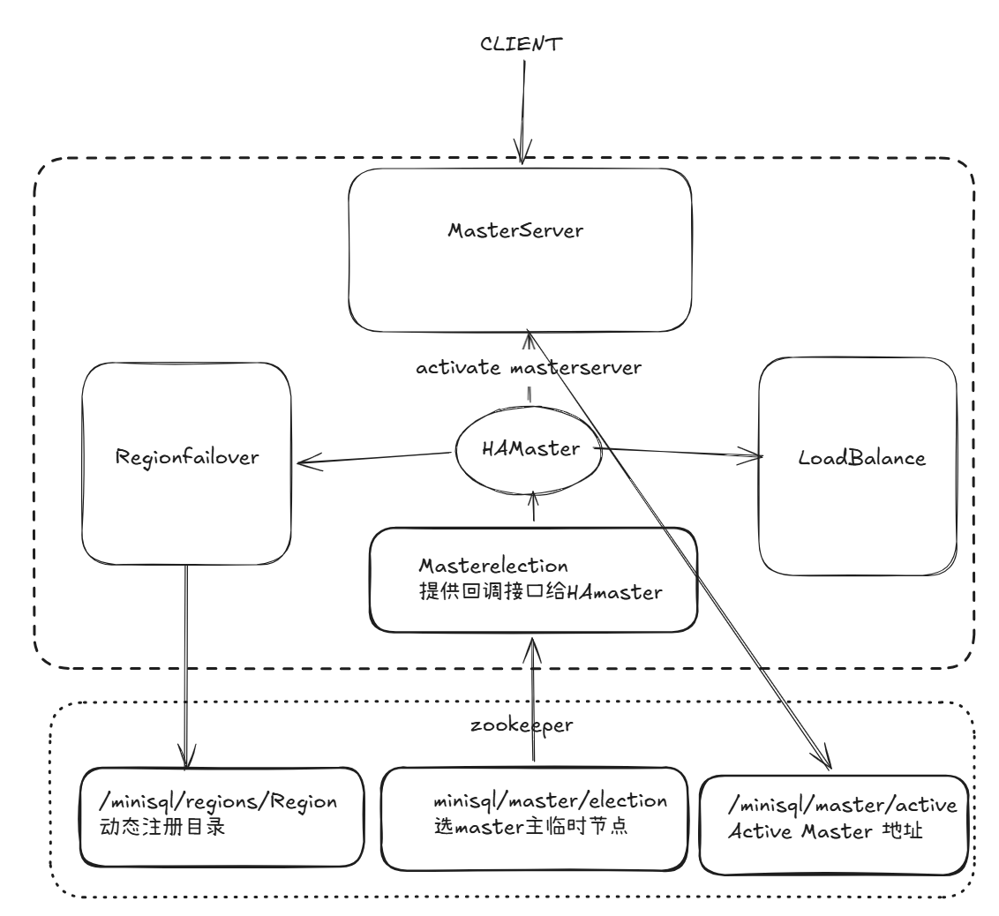

# 分布式minisql
## 分工
3240103356 李胡诚  完成所有部分
## 设计模块层
整体架构图如下


### client
为了应对高并发、节点动态上下线，故障转移，client被设计为
无状态的智能客户端。

无状态指其本身不会存储任何持久化数据，但可以处理部分业务路由

**执行模块**
``` java
public string execute(string sql)  //暴露对外的接口

public string execute(string sql, int retries) //实际执行，带重试机制

private String getRegionAddress(String tablename,boolean isCreateTable , int attempt) // 内部路由决策方法，建表语句直接走master,查询语句，优先查看本地缓存

private String extractTableName(String sql) // 解析sql输入
```

**Route Cache**
维护了一个缓存路由表，设置了最长生命周期
``` java
cacheTlimMs = 60
Map<string,sting> regionCache
Map<string,string> cacheTimestamp
public void setEnableCache(boolean enableCache)
public refreshCache()
```

**Region&Master Conn Module**
对于master节点的交互，暂时采用同步通信
``` java
private String[] getActiveMaster()
private String sendToMaster(int requestType,String tableName)  //返回region节点
public String sendToRegion(string regionAddr,String sql) //发送sql给region
public boolean healthCheck()
```
**monitor & telemetry**
``` java
private void recordSuccess(String regionAddr, long responseTime) //暂时还未实现
public String GetStatus()
```
### master层
为了提高系统的高可用性与容错能力，系统设计了 Active-Standby 的双主高可用架构。`HAMasterServer` 整合了下述核心组件，使得控制面在发生单点故障时能够秒级自愈：



**MasterElection（Master 选举模块）**
*   **实现原理**：基于 Apache Curator 的 `LeaderSelector` 机制实现公平选举。
*   **核心生命周期监听**：实现 `LeaderSelectorListener` 接口，定义内部接口 `MasterStateListener`。
*   **方法结构**：
    *   `public void start()`：启动选举，将当前 MasterId 加入到 `/minisql/master/election` 抢占队列中。
    *   `public void takeLeadership(CuratorFramework client)`：当选为 Leader 时的回调。当选后向 ZK 写入临时节点 `/minisql/master/active` 暴露自身地址，并维持领导权，直至网络中断或主动停止。
    *   `public void stateChanged(...)`：监听连接状态（`LOST` / `SUSPENDED`），在网络分区时自动放弃领导权，避免脑裂（Split-Brain）。

**LoadBalance（负载均衡器）**
*   **多种分发策略**：内置 `LoadBalanceStrategy` 枚举，支持 5 种工业级均衡算法：
    *   `ROUND_ROBIN` (轮询)、`RANDOM` (随机)、`LEAST_CONN` (最少活动连接，自适应调度)。
    *   `WEIGHTED` (加权轮询，匹配异构机器性能)、`HASH` (哈希一致性，实现表亲和性)。
*   **核心接口**：
    *   `public void addRegion(String id, String address)` / `removeRegion`：动态增删可用节点。
    *   `public String getNextRegion(String tableName)`：根据当前策略决策，返回负责该表的 Region 物理地址。
    *   `public void recordRequest(String address, long responseTime, boolean success)`：收集时延和成功率，为自适应路由提供元数据支撑。

**MasterServer（路由与服务发现协调节点）**
*   **职责**：充当控制面网关，基于 `ServiceDiscovery` 动态感知所有 RegionServer。
*   **路由解析接口**：
    *   `GET_REGION`：客户端发送 SQL 读写前，请求 Master 获取表所在的 Region 地址。
    *   `CREATE_TABLE`：建表请求，Master 调用 `LoadBalancer` 决策目标物理节点，在路由表 `tableToRegion` 中建立静态路由记录并返回给客户端。
*   **自适应节点剔除**：绑定 ZK 监听器，在 `onRegionOffline` 触发时自动将该节点名下的所有数据表路由关系解除。

**RegionFailover（Region 故障检测与容灾模块）**
*   **故障发现机制**：采用“ZK 节点变更监听”与“Socket 重试探针”双重机制。
*   **核心逻辑**：
    *   在 Active Master 启动时拉起后台单线程定时调度器 `healthChecker`（每 5 秒执行一次）。
    *   通过 `checkRegionAlive(address)` 尝试与各 RegionServer 建立 Socket 短连接。
    *   当连接失败次数超过 `MAX_RETRY_COUNT` (3次) 时，触发 `onRegionFailed` 监听器通知，调用负载均衡器 `markAvailable(address, false)` 将其摘除，并在路由表实施应急降级。


### region层
Region 层是底层的物理存储与查询执行引擎，实现了读写高性能与数据强可靠：

#### 1. DatabaseManager（物理数据库管理器）
*   **作用**：协调 SQL 解析器、单机存储引擎与主从复制管理器。
*   **元数据落盘**：在 `catalog.meta` 中使用序列化技术持久化表结构（Schema）元数据，启动时调用 `loadCatalog()` 加载，建表时调用 `saveCatalog()` 刷盘。
*   **SQL 执行逻辑与复制**：
    *   `public String execute(String sql)`：调用 `SimpleParser` 解析 SQL 类型（CREATE, INSERT, SELECT, UPDATE, DELETE）。
    *   若是写操作（CREATE, INSERT, DELETE, UPDATE），执行成功后调用 `ReplicationManager.replicateSQL(sql)`，向从节点推送修改指令。

#### 2. LSMTreeEngine（单机 LSM-Tree 存储引擎）
*   **WAL 预写日志 (`WAL.java`)**：`put` 或 `delete` 时先以二进制 append 形式持久化到 `wal_*.log` 文件中，保证灾难自愈能力。
*   **MemTable 内存表 (`MemTable.java`)**：利用基于跳表或 TreeMap 维护的有序内存表实现极速写入。当大小达到阈值时调用 `flush()` 转换成 SSTable 写入磁盘。
*   **SSTable 磁盘归档 (`SSTable.java`)**：只读的数据文件，采用按 ID 从大到小组织（新的在前）。
*   **异步 Compaction 合并**：当 SSTable 数量超过 5 个时，触发 `compact()`，合并最旧的 3 个 SSTable，对相同 Key 进行版本覆盖，并物理清除带删除标记（Tombstone）的数据，解决读放大与空间放大问题。

#### 3. ReplicationManager（主从复制管理器）
*   **双角色设计**：
    *   `MASTER` 角色：调用 `startReplicationServer()` 开启专用 Socket 同步端口，维持从节点连接池 `slaves`。在执行 DML 时，调用 `replicateSQL(sql)` 推送逻辑日志。
    *   `SLAVE` 角色：拉起专用后台同步线程 `syncWithMaster()` 直连主节点的复制端口，通过 `REPLICATE_SQL` 通信帧拉取修改类 SQL，在本地 `dbManager` 重放（Replay），保证主从数据最终一致性。

### Network通信层
系统实现了一套轻量级的自定义二进制网络协议与 BIO 并发网络框架，保障客户端与服务端、主从节点间的数据传输高效与可靠：

#### 1. 自定义二进制协议 (`protocol/Message`)
摒弃了臃肿的 HTTP 协议，基于 TCP 定制了应用层二进制报文协议，解决定界与黏包问题。
*   **报文结构**：严谨的 `Header + Body` 设计。
    *   `Magic` (4 bytes)：魔数 `0x4D53514C` ("MSQL")，用于包头识别与过滤非法流量。
    *   `Total Length` (4 bytes)：记录完整长度，配套前置的包体长度发送，解决 TCP 流式黏包。
    *   `Type` & `Status` & `RequestID`：标识请求/响应消息（诸如 SQL_EXECUTE、GET_REGION 等类型）、成功/失败状态，并建立 RPC 的因果关联标识。
    *   `Body`：变长部分，承载 UTF-8 编码的 SQL 文本或数据结果。
*   **序列化机制**：利用 `java.nio.ByteBuffer` 提供 `encode()` 与 `decode()`，实现内存紧凑的高效字节转化。

#### 2. 并发网络 IO 模型 (`RegionServer`)
*   **通信架构**：采用稳健的同步阻塞 `BIO + 动态线程池` 模型处理多并发入站（Thread-Per-Message 模式）。
*   **执行与响应全双工**：主线程循环 `serverSocket.accept()`，每当客户端连入即生成独立的 `ClientHandler` 任务抛给 `CachedThreadPool`；工作线程基于 `DataInputStream.readFully()` 配合前置 Length 头，安全的拉取完整报文字节组以规避网络抖断。解析出的 SQL 指令流转到底层的 `DatabaseManager` 执行，结果重封包即时写回 Socket 链路。

---

## 测试与运行

本系统设计了高精度集成测试类 `HATest.java`，全方位验证了系统的故障自愈、负载均衡和一致性：

### 1. 双 Master 高可用选举测试 (`testMasterFailover`)
*   **验证流程**：
    1.  启动 `Master1 (端口9999)` 和 `Master2 (端口9998)`。
    2.  等待 3 秒后，Curator `LeaderSelector` 自动完成 Active 选举（Master1 胜出抢占 `/active` 节点）。
    3.  启动 `Region1 (8801)` 和 `Region2 (8802)` 并向 ZK 注册。
    4.  Client 连接 Master1 执行正常建表、插入及点查询。
    5.  主动调用 `master1.stop()` 模拟主 Master 掉线。
    6.  **结果观测**：ZK 临时节点摘除，Master2 秒级自动被提升为新 Leader。客户端捕捉到连接异常后，**主动清除本地缓存**，重新从 ZK 寻找 active master 并再次发起重试，第二条插入和查询语句成功执行，整个故障切换过程对业务完全透明。

### 2. Region 负载均衡与路由分发测试 (`testRegionLoadBalance`)
*   **验证流程**：
    1.  开启 Region1 和 Region2。
    2.  Client 发起建表 `CREATE TABLE lb_test`，Master 负载均衡器决定该表归属于某个 Region。
    3.  连续向该表中插入 10 条测试数据。
    4.  **结果观测**：Master 的 `LoadBalancer` 采用轮询（Round-Robin）或哈希算法将多次请求均摊到在线的两个 Region 上。客户端统计模块捕获的 Socket 路由输出精确展示了数据流均匀地路由到 `localhost:8801` 和 `localhost:8802`，验证了负载分摊的准确性。